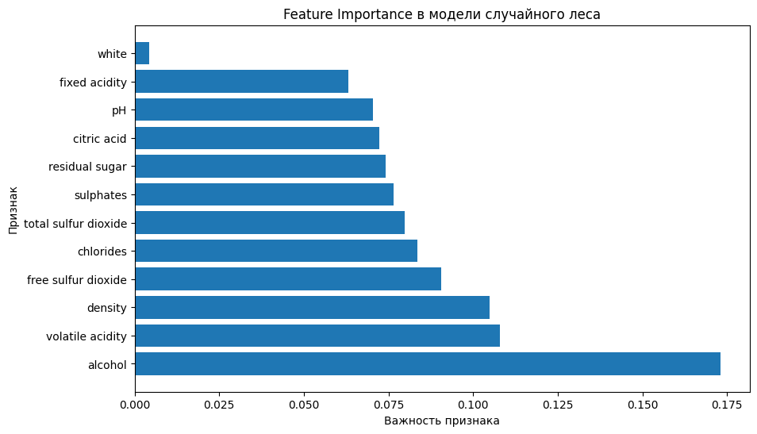
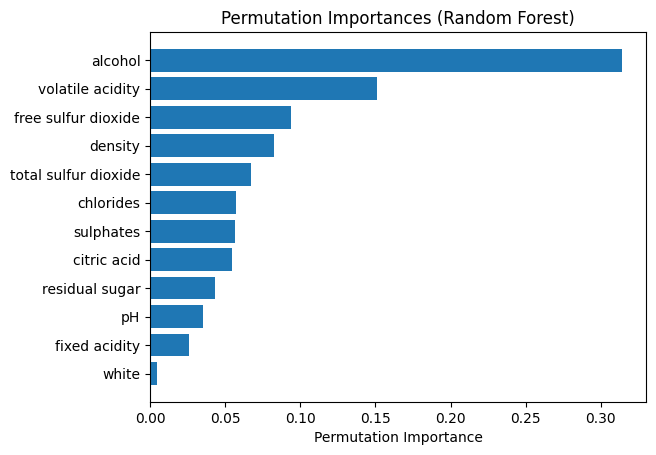
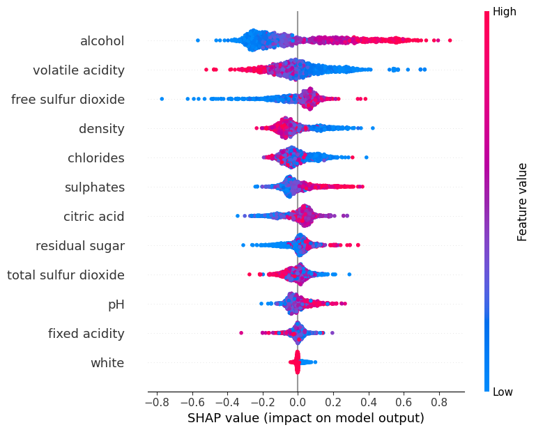

# Задание 3

Качество константного предсказания: $MAE=0.63722$  
Качество бейзлайн-модели: $MAE=0.57029$

В качестве более сложной модели для задачи регрессии был выбран случайный лес. Подбор гиперпараметров с помощью sklearn и optuna, обучение и измерение качества модели производится в ноутбуке [random_forest.ipynb](random_forest.ipynb)

Качество построенной модели: $MAE = 0.38826$

### Интерпретация построенной модели

**Важность признаков:**

**Permutation importance:**

**SHAP:**

**Выводы:** Признаки alcohol, volatile accidity - самый важный, а признак white - неважный, его можно исключить