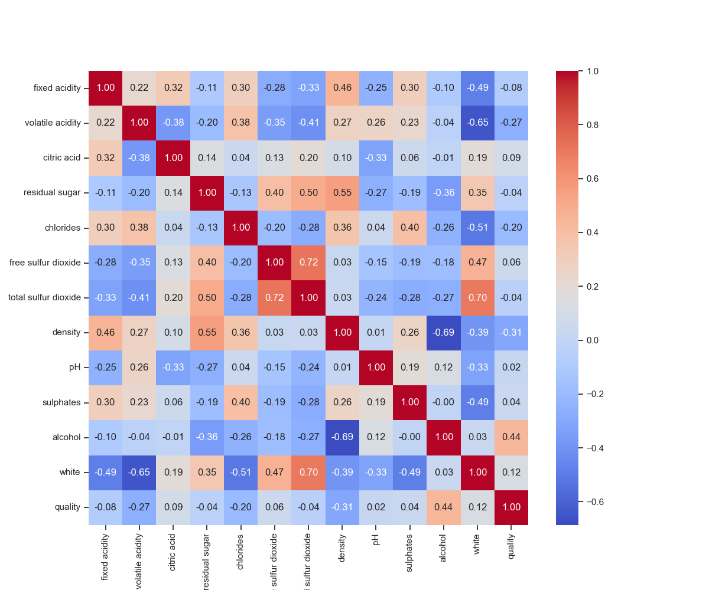
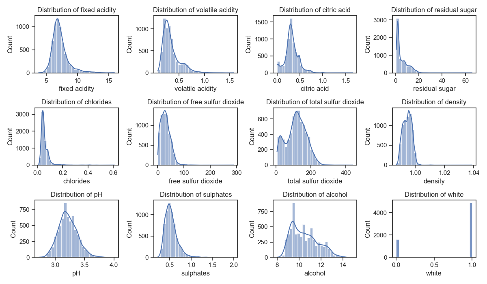
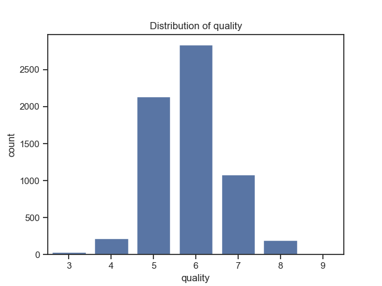

# Задание 1

### 1. Постановка задачи

**Бизнес-задача:** реализовать алгоритм, прогнозирующий качество вина на основе его физикохимических характеристик.

**ML-задача:** разработать модель машинного обучения для задачи регрессии с целью предсказания качества вина на основе его характеристик.

**Датасет:** [Wine Quality](https://archive.ics.uci.edu/dataset/186/wine+quality) - 6497 записей о красном и белом вине с их физикохимическими характеристиками. Изначально предоставляется в виде двух файлов - [winequality-red.csv](datasets/winequality-red.csv) и [winequality-white.csv](datasets/winequality-white.csv). В ноутбуке [dataset.ipynb](dataset.ipynb) происходит их объединение в файл [winequality.csv](datasets/winequality.csv). Также к каждой записи добавляется колонка, указывающая, является вино красным или белым.

### 2. Выбор метрики для измерения качества регрессии

Метрика - **Mean Absolute Error (MAE)**. Оценка качества вина в значительной степени зависит от восприятия эксперта, что может привести к субъективности и неточности оценок. MAE позволит в среднем хорошо предсказывать экспертные оценки и при этом так не зависеть от выбросов, как, например, MSE.

### 3. Разведочный анализ датасета.

Проводился в ноутбуке [eda.ipynb](eda.ipynb)

#### Описание колонок:

||fixed acidity     |volatile acidity   |citric acid        |residual sugar   |chlorides          |free sulfur dioxide|total sulfur dioxide|density              |pH                 |sulphates          |alcohol           |quality           |
|------|------------------|-------------------|-------------------|-----------------|-------------------|-------------------|--------------------|---------------------|-------------------|-------------------|------------------|------------------|
|mean  |7.2 |0.34 |0.32 |5.44|0.056|30.5 |115.7   |0.99470   |3.22 |0.53 |10.5|5.8 |
|std   |1.3|0.16|0.15|4.76|0.035|17.7   |56.5  |0.00300|0.16|0.15|1.2|0.9|
|min   |3.8               |0.08               |0.0                |0.6              |0.009              |1.0                |6.0                 |0.98711              |2.72               |0.22               |8.0               |3.0               |
|25%   |6.4               |0.23               |0.25               |1.8              |0.038              |17.0               |77.0                |0.99234              |3.11               |0.43               |9.5              |5.0               |
|50%   |7.0               |0.29               |0.31               |3.0              |0.047              |29.0               |118.0               |0.99489              |3.21               |0.51               |10.3               |6.0               |
|75%   |7.7               |0.4                |0.39               |8.1              |0.065              |41.0               |156.0               |0.99699              |3.32               |0.6                |11.3               |6.0               |
|max   |15.9              |1.58               |1.66               |65.8             |0.611              |289.0              |440.0               |1.03898              |4.01               |2.0                |14.9             |9.0               |

Из данных неясно, в каких единицах измерения приведены значения. Требуется провести нормализацию характеристик.

#### Матрица корреляции характеристик:

Наблюдается высокая корреляция между *free sulfur dioxide* и *total sulfur dioxide*, между *residual sugar* и *density*, обратная корреляция между *density* и *alcohol*. Возможно, стоит убрать один признак из пары из рассмотрения или преобразовать пару в один признак.

Признак *white* сильно кореллирует сразу со многими признаками, возможно, его не стоит учитывать.

#### Распределение характеристик:

#### Распределение целевой переменной - качества вина:

